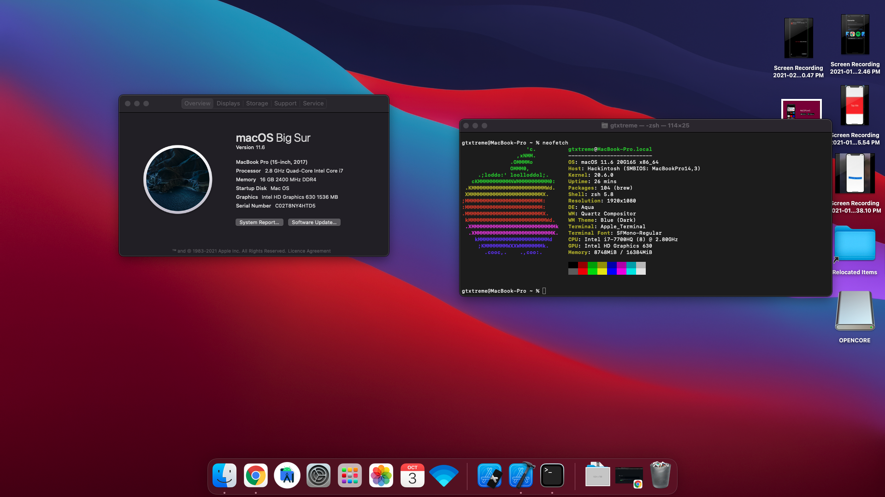

# Hackintosh--MSIGL62M-7RDX
Hackintosh for the MSI GL62M 7RDX




## Specifications

### Opencore and MacOS

```
OpenCore version: 0.7.3 (Sept 2021)
MacOS: MacOS Big Sur 11.6
```

### Hardware Specifications

- **CPU**: Intel Core i7 - 7700HQ
- **Sound**: ALC899
- **Graphics**: Intel HD630 Full HD - GTX 1050
- **Wifi**: Built in Using [itlwm](https://github.com/OpenIntelWireless/itlwm) - Atheros 2200
- **SSD**: NVME 500GB Transcend
- **HDD**: 1TB for Storage(Built In)

### Guide/Tips
Well, to be honest, this is not a guide to get a working Hackintosh up on this laptop but just a backup of my EFI which works. For any detailed information and guide you can refer to the below mentioned repositories. Almost everything works except the webcam, which is not a big issue to me

I have a tri-boot system, i.e. Arch Linux, Windows and Mac OS. Always start with Mac OS first without any other OS installed on your system. That way the workflow goes smoothly. For some reason you can't give up Windows completely on the laptop because the BIOS doesn't recognize any other OS then. Also adding Opencore entry to the BIOS fails for some reason so I have to use my bootable USB always to boot into Mac OS. Also keep a copy of your Linux in another pendrive, because Windows acts mischievous and eats up grub for some reason. Last, but not the least, there were many people who told me this won't work on a single SSD for all the three OS, and you will need a dedicated SSD for MacOS, Guess who proved them wrong 😎


### Huge Thanks to 
[Hackintosh MSI GL72M 7RDX by jbwharris](https://github.com/jbwharris/hackintosh-msi-GL72M-7RDX)
